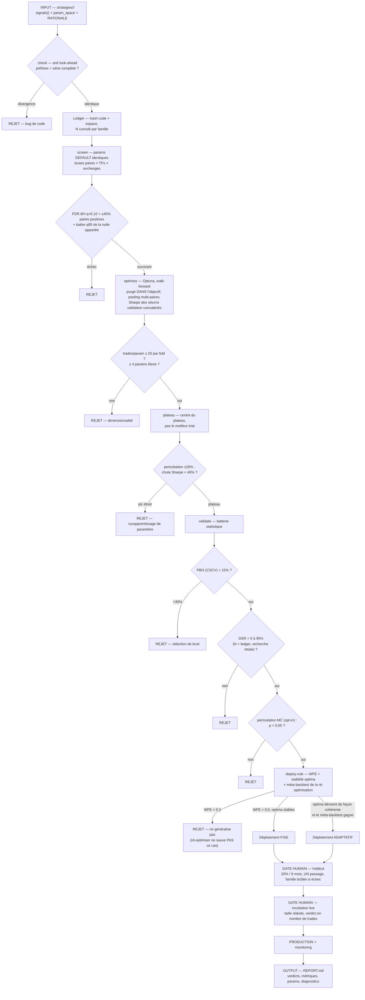

# quantlab — Pipeline de validation de stratégies quantitatives

Pipeline de recherche Botlyz (Lighter / Hyperliquid / Binance, VectorBT PRO + Optuna + marimo).
Remplace l'ancien workflow WFA/MCCV (archivé dans `archive/`).

> **Le p-hacking ne s'évite pas avec une technique. Il s'évite avec de la comptabilité.**
>
> 1. chaque backtest est **loggé** au ledger (`N` cumulé par famille),
> 2. le résultat final est **corrigé** pour ce `N` (Deflated Sharpe Ratio),
> 3. le holdout n'est consommé **qu'une seule fois** (verrou physique),
> 4. la validation finale est du **capital réel** en petite taille.

Le seuil de Sharpe crédible monte en `√(2·ln N)` — il est affiché en permanence
dans le terminal de progression et le dashboard.

---

## Démarrage rapide

```bash
cd BTYZ/src
source ../.venv/bin/activate

# 0. données: synchroniser le store parquet (download Binance 1m si absent)
python -m quantlab.cli data sync                 # tout l'univers, toutes TFs
python -m quantlab.cli data status               # couverture paires × TF × source

# 1. lister les stratégies découvertes dans strategies/ + état du pipeline
python -m quantlab.cli list
python -m quantlab.cli status                    # funnel global (verdicts, N, seuil)

# 2. lancer le flow complet automatisable sur une stratégie
#    (check → screening → optimize → plateau → stats → deploy-rule,
#     s'arrête au premier REJET)
python -m quantlab.cli run OI_FADE_v1

# ... ou étape par étape
python -m quantlab.cli check     OI_FADE_v1      # contrat + anti look-ahead
python -m quantlab.cli screen    OI_FADE_v1      # étape 1
python -m quantlab.cli optimize  OI_FADE_v1      # étape 2
python -m quantlab.cli plateau   OI_FADE_v1      # étape 3
python -m quantlab.cli validate  OI_FADE_v1      # étape 4 (PBO + DSR)
python -m quantlab.cli validate  OI_FADE_v1 --permutation   # + permutation MC (long)
python -m quantlab.cli deploy-rule OI_FADE_v1    # étape 5

# 3. gate humain — holdout, UN SEUL passage par famille, irréversible
python -m quantlab.cli holdout   OI_FADE_v1      # demande de taper "BURN OI_FADE"

# 4. fiche stratégie finale
python -m quantlab.cli report    OI_FADE_v1      # results/quantlab/OI_FADE_v1/REPORT.md

# Dashboard marimo (lecture seule — ne lance jamais de calcul)
marimo run notebooks/quantlab/dashboard.py
```

Sans arguments, les commandes proposent une sélection interactive des stratégies.
Chaque commande longue affiche un terminal de progression (étape, barres, ETA,
nombre de tests consommés, dette de recherche de la famille).

---

## Ajouter une stratégie

Glisse un dossier dans `strategies/` :

```
strategies/MA_STRAT_v1/
├── strategy.py       # class Strategy(BaseStrategy) — voir src/quantlab/contract.py
├── RATIONALE.md      # OBLIGATOIRE: la thèse économique (pourquoi ça devrait marcher)
└── manifest.yaml     # optionnel: screen_tfs, notes
```

```python
from quantlab.contract import BaseStrategy, Signals

class Strategy(BaseStrategy):
    FAMILY = "MA_STRAT"       # clé du research_debt (toutes versions confondues)
    VERSION = 1
    DATA_SOURCE = "lighter"   # lighter | binance | oi | gapfill | cross_exchange
    TF = "1h"                 # timeframe native
    SCREEN_TFS = ["15m", "1h", "4h"]   # TFs screenées (défaut: [TF])
    DEFAULT_PARAMS = {"lookback": 100, "z": 2.0}   # screening: identiques sur TOUTES les paires
    FIXED = {"sl_atr": 2.0}   # fixé par logique économique, jamais optimisé

    def signals(self, data, params):
        # DOIT être causal — vérifié automatiquement par le test de préfixes.
        # Coupables classiques: .shift(-1), z-score/quantile sur toute la série,
        # rolling centré, interpolation de NaN.
        ...
        return Signals(long_entries=..., long_exits=..., sl_stop=params["sl_pct"])

    def param_space(self, trial):   # ≤ 4 paramètres libres (refus au-delà)
        return {"lookback": trial.suggest_int("lookback", 50, 400),
                "z": trial.suggest_float("z", 1.0, 3.5)}
```

Le moteur backteste lui-même (`from_signals`, frais/slippage injectés) — la
stratégie ne produit **que des signaux**. C'est ce qui rend le test anti
look-ahead générique et le pooling multi-paires possible.

---

## Le flow (étapes automatisables = `run`)



---

## Seuils (src/quantlab/config.py — ne pas ajuster pour faire passer une stratégie)

| Étape | Métrique | Passage | Rejet |
|---|---|---|---|
| check | Test look-ahead (20 préfixes) | identique | toute différence |
| screen | FDR Benjamini-Hochberg (q) | < 0,10 | ≥ 0,10 |
| screen | Paires positives (TF native) | ≥ 45 % | < 45 % |
| screen | vs nulle appariée | > q95 | ≤ q95 |
| optimize | Trades / paramètre libre / fold | ≥ 20 | < 20 |
| optimize | Paramètres libres | ≤ 4 | > 4 |
| plateau | Chute Sharpe sous ±20 % | < 40 % | ≥ 40 % |
| validate | PBO (CSCV, 16 blocs) | < 15 % | > 30 % |
| validate | DSR (N = ledger) | > 0 à 95 % | ≤ 0 |
| validate | p-value permutation (200 runs) | < 0,05 | ≥ 0,05 |
| deploy-rule | WFE | > 0,5 | < 0,3 |
| holdout | Cohérence avec l'OOS | dégradation 30-50 % | effondrement |
| incubation | Slippage/funding réels | dans le modèle | au-delà |

## Données

- Univers : toutes les paires × TFs `1m 3m 5m 15m 1h 4h` × sources `lighter`, `binance`.
- Store canonique parquet `data/quantlab_store/<source>/<tf>/<pair>.parquet`,
  construit depuis `data/raw/` (CSV) + resample ; `data sync` télécharge le
  manquant (klines 1m Binance via data.binance.vision).
- **Holdout** : les derniers `min(6 mois, 20 %)` de chaque série, verrouillés par
  hash. Le pipeline ne peut physiquement lire que le dev set ; l'accès holdout
  exige un token one-shot émis par le ledger (`holdout` CLI). Un 2ᵉ passage sur
  la même famille est refusé définitivement.
- Ajouter un exchange = un module dans `src/quantlab/data/sources/` respectant
  l'interface `Source` (pairs / load_raw / download).

## Architecture

```
strategies/                  # ← tes stratégies (INPUT du flow)
src/quantlab/
├── contract.py  config.py   # contrat Strategy + tous les seuils
├── ledger.py                # SQLite: research_debt, verdicts, verrou holdout
├── registry.py  lookahead.py  backtest.py  progress.py
├── data/                    # sources, store parquet, splits dev/holdout, sync
├── screening.py  optimize.py  plateau.py
├── stats/                   # pbo.py (CSCV), dsr.py, permutation.py
├── deploy_rule.py  gates.py  report.py
└── cli.py                   # python -m quantlab.cli
notebooks/quantlab/dashboard.py   # marimo (lecture seule)
results/quantlab/<STRATEGY_ID>/<stage>/   # verdicts JSON + matrices parquet
ledger.db                    # registre central (gitignoré)
archive/                     # ancien workflow WFA/MCCV + anciennes approches
```

## Règles non négociables

- **Jamais** de lecture du holdout hors `gates.py`. Jamais de 2ᵉ passage.
- Re-runs (`--force`) : les tests sont **comptés en plus**, jamais décomptés.
- Budget de trials fixé **avant** le run et loggé.
- Le dashboard marimo **lit**, il ne lance rien.
- Méfie-toi de tout résultat qui te fait plaisir.
